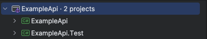
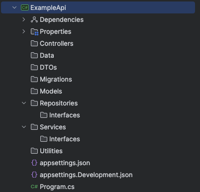
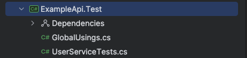

# Project Structure

ตัวอย่างของการพัฒนา REST API ด้วย .NET สำหรับการจัดการข้อมูล และการทดสอบ (Unit Testing) ด้วย xUnit และ Moq โครงสร้างโปรเจคถูกออกแบบเพื่อให้การพัฒนาซอฟต์แวร์มีความชัดเจนและยืดหยุ่นในการปรับปรุงแก้ไข

## โครงสร้างโปรเจค

โครงสร้างของโปรเจคถูกจัดตามนี้:

1. `ExampleApi` เป็นโฟลเดอร์ที่ใช้เก็บ Source code สำหรับพัฒนา Service ทั้งหมด
2. `ExampleApi.Test` เป็นโฟลเดอร์ใช้เก็บ Source code Unit test



### ExampleApi

โครงสร้างของ Service โฟลเดอร์ถูกจัดตามนี้:



1. `Controllers` ประกอบด้วยตัวควบคุมเส้นทางของ API ที่จัดการ HTTP Request and Response ตัวอย่าง

```csharp
using ExampleApi.DTOs.Response;
using ExampleApi.Services.Interfaces;
using Microsoft.AspNetCore.Mvc;

namespace ExampleApi.Controllers;
[ApiController]
[Route("api/user")]

public class UserController : ControllerBase
{
    private readonly IUserService _userService;

    public UserController(IUserService userService)
    {
        _userService = userService;
    }

    [HttpGet]
    public async Task<List<UserResponse>> GetUsers()
    {
        return await _userService.GetUsers();
    }
}
```

2. `Data` ประกอบด้วย DbContext และการกำหนดค่าที่เกี่ยวข้องกับ Entity Framework Core

```csharp
namespace ExampleApi.Data;

public class AppDbContext : DbContext
{
    public AppDbContext(DbContextOptions<AppDbContext> options) : base(options) { }
    public DbSet<User> Users { get; set; }
}
```

3. `DTOs` ประกอบด้วย Data Transfer Objects (DTO) สำหรับ Property สำหรับ Request and Response

```csharp
namespace ExampleApi.DTOs.Response;

public class UserResponse
{
    public int Id { get; set; }
    public string Username { get; set; } = string.Empty;
    public string Email { get; set; } = string.Empty;
}
```

4. `Migrations` ประกอบด้วย Migration files (Auto generate)
5. `Models` ประกอบด้วย Model หรือ Entity ที่แสดงข้อมูล

```csharp
namespace ExampleApi.Models;

public class User
{
    public int Id { get; set; }
    public string Username { get; set; } = String.Empty;
    public string Email { get; set; } = String.Empty;
    public bool IsActive { get; set; }
}
```

6. `Repositories` ประกอบด้วย Interface ที่เก็บข้อมูลและการนำไปใช้สำหรับการเข้าถึงข้อมูล

```csharp
using ExampleApi.Models;

namespace ExampleApi.Repositories.Interfaces;

public interface IUserRepository
{
    Task<List<User>> GetAllAsync();
}
```

```csharp
using ExampleApi.Repositories.Interfaces;

namespace ExampleApi.Repositories;

public class UserRepository : IUserRepository
{
    public UserRepository(AppDbContext context) : base(context) {}
}
```

7. `Services` ประกอบด้วย Interface และฟังก์ชันที่มี Business logic

```csharp
using ExampleApi.DTOs.Response;

namespace ExampleApi.Services.Interfaces;

public interface IUserService
{
    Task<List<UserResponse>> GetUsers();
}
```

```csharp
using ExampleApi.DTOs.Response;
using ExampleApi.Repositories.Interfaces;
using ExampleApi.Services.Interfaces;

namespace ExampleApi.Services;

public class UserService : IUserService
{
    private readonly IUserRepository _userRepository;

    public UserService(IUserRepository userRepository)
    {
        _userRepository = userRepository;
    }
    public async Task<List<UserResponse>> GetUsers()
    {
        try
        {
            List<UserResponse> users = await _userRepository.GetAllAsync();
            return users;
        }
        catch (Exception ex)
        {
            throw new Exception(ex.Message);
        }
    }
}
```

8. `Utillities` ประกอบด้วย utility classes และ helpers

### ExampleApi.Test

โครงสร้างของ Unit test โฟลเดอร์ถูกจัดตามนี้:



1. `GlobalUsings.cs` ใช้สำหรับประกาศการใช้งาน class ที่ใช้งานซ้ำๆ หลายครั้งแทนการเรียกใช้งานทุกไฟล์

ตัวอย่าง

```csharp
global using Xunit;
```

2. `<UNIT_TEST_CLASS>` ในตัวอย่างนี้คือ `UserServiceTest` ใช้เขียนฟังก์ชันสำหรับ Unit test

ตัวอย่าง

```csharp
using ExampleApi.DTOs.Response;
using ExampleApi.Models;
using ExampleApi.Services.Interfaces;
using Moq;

namespace ExampleApi.Test;

public class UserServiceTests
{
    private readonly Mock<IUserService> _userServiceMock;

    public UserServiceTests()
    {
        _userServiceMock = new Mock<IUserService>();
    }

    [Fact]
    public async Task GetUserAsync_ValidUser_ReturnsUser()
    {
        List<User> users = new List<User>
        {
            new User()
            {
                Id = 1,
                Email = "email@email.com",
                Username = "user1",
                IsActive = true
            },
            new User()
            {
                Id = 2,
                Email = "user2@email.com",
                Username = "user2",
                IsActive = true
            }
        };

        List<UserResponse> expectedResult = new List<UserResponse>
        {
            new UserResponse()
            {
                Id = 1,
                Email = "email@email.com",
                Username = "user1"
            },
            new UserResponse()
            {
                Id = 2,
                Email = "user2@email.com",
                Username = "user2"
            }
        };

        _userServiceMock.Setup(service => service.GetUsers()).ReturnsAsync(expectedResult);
        List<UserResponse> actualResult = await _userServiceMock.Object.GetUsers();

        Assert.Equal(expectedResult, actualResult);
        Assert.IsType<List<UserResponse>>(actualResult);
    }
}
```

